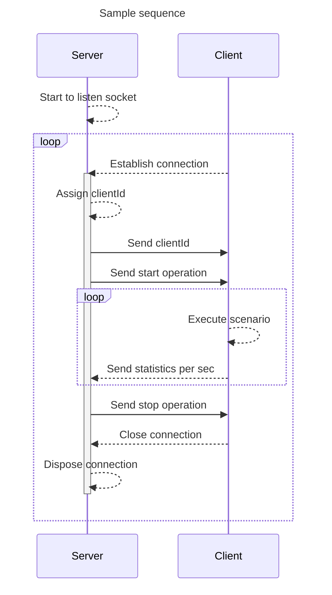

# Heavyrain server client model test

```mermaid
---
title: Sample sequence
---
sequenceDiagram
    participant Server
    participant Client

    Server-->>Server: Start to listen socket
    loop
        Client-->>Server: Establish connection
        activate Server
        Server-->>Server: Assign clientId

        Server->>Client: Send clientId

        Server->>Client: Send start operation

        loop
            Client-->>Client: Execute scenario
            Client-->>Server: Send statistics per sec
        end

        Server->>Client: Send stop operation
        Client-->>Server: Close connection

        Server-->>Server: Dispose connection
        deactivate Server
    end
```
